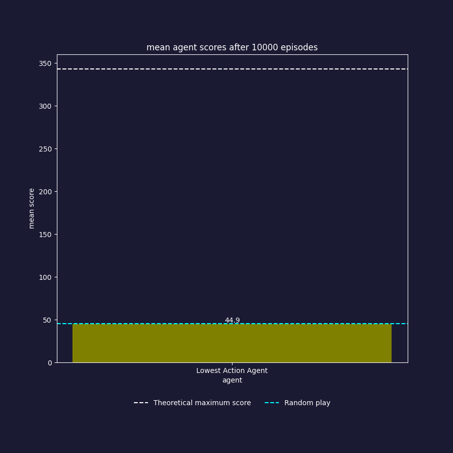

# Yahtzee!

### Implementing new agents
- Create a new file for your agent: yahtzee/agents/<your_agent>.py
- Implement your agent by inheriting from Agent and implementing its methods
- Make sure you import your agent in yahtzee/agents/\__init__.py
- Import your agent in yahtzee/arena.py
- Add your agent class type in AGENTS in yahtzee/arena.py
- (OPTIONAL): Run scripts/evaluate_agents.py to see how it performs compared to the other agents.

### Agent evaluations

